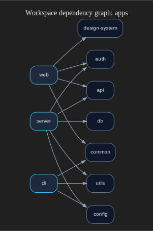
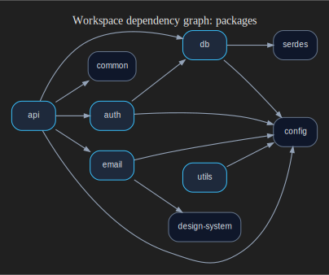
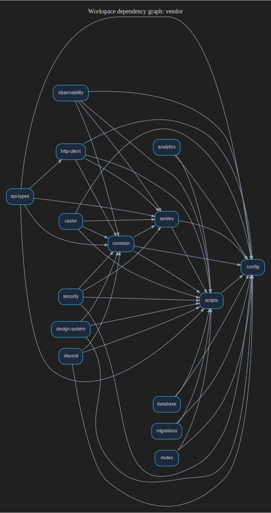
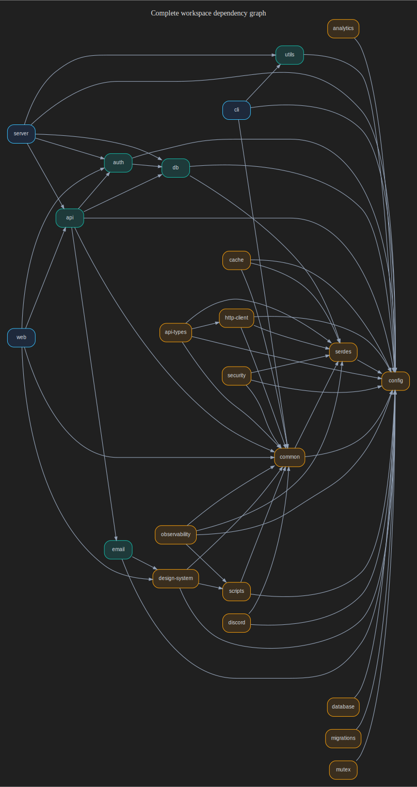

This section contains auto-generated workspace dependency graphs grouped by scope. Each node is a workspace package (app, package, or vendor package), and each edge represents a direct dependency between workspace packages.

Regenerate these graphs with:

```bash
pnpm gen:dependency-graphs
```

{/*
  Note: Use local imports to support placeholder/blur. Not relevant for
  SVG assets, but good practice regardless
*/}

## Apps



## Packages



## Vendor



## Complete Overview


